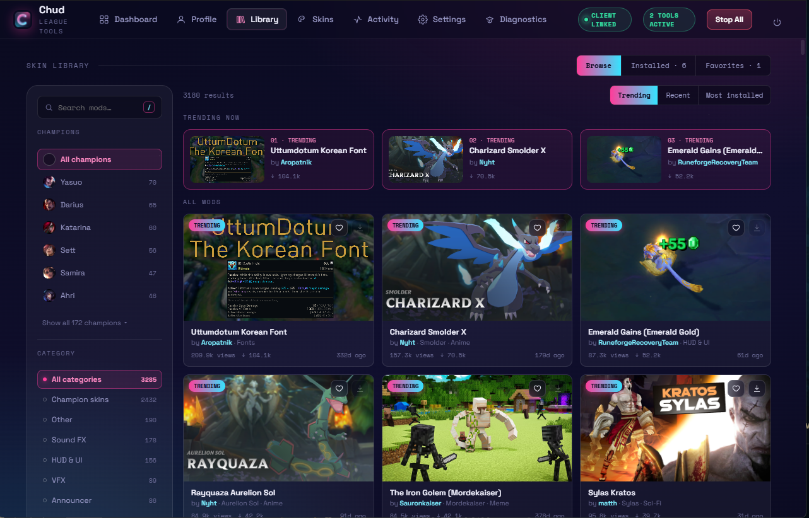

<p align="center">
  
</p>

<h1 align="center">Chud</h1>

<p align="center">
  A friendly desktop companion for League of Legends — <b>change your skins</b>, sync them
  with your friends automatically, auto-accept your queues, and keep range indicators on
  screen. One tiny <code>.exe</code>, built in Rust, and it <b>updates itself</b>.
</p>

<p align="center">
  <a href="https://github.com/ChudTonic/League-Of-Legends-Auto-Accept-Range/releases/latest"><b>⬇️ Download the latest installer</b></a>
  &nbsp;·&nbsp;
  <a href="https://discord.gg/SxS5yjdnwR"><b>💬 Join the Discord</b></a>
</p>

---

## ⚡ Quick start

1. **[Download the installer](https://github.com/ChudTonic/League-Of-Legends-Auto-Accept-Range/releases/latest)** (`Chud_x.y.z_x64-setup.exe`) and run it. It installs for your user only — no admin install needed.
2. Launch **Chud**, and start League. Chud finds your client automatically.
3. That's it — Chud **keeps itself up to date**. When a new version is out, a **✨ update pill** appears in the top bar; click it and Chud downloads, installs, and restarts on its own. No reinstalling, no re-downloading, no manual file swaps.

> 💬 **Questions or want to play with skin sync?** [Join the Chud Discord](https://discord.gg/SxS5yjdnwR).

> 💡 **Skins need one extra one-time file.** For legal reasons we can't ship the skin-injection library. Drop your own copy of `cslol-dll.dll` into `%LOCALAPPDATA%\Chud\cslol-tools\` once, and skins work forever after — it survives every update.

## ✨ What it does

### 🎨 Skins — the main event

Pick any skin (or chroma) for any champion, right inside the League client. Chud injects it locally so **you** see it in champ select and in game.

- **In-client menu** — press **`C`** in the League client to open Chud's skin picker. No alt-tabbing.
- **Any skin, any champion** — owned or not, on your screen.
- **Chromas & custom skins** — chroma wheel, custom mod support, "historic" older skins, and a random-skin roll.
- **🤝 Seamless party sync** — when you're in a lobby with friends who also use Chud, it **auto-detects them and syncs everyone's skin choices** — so you all see each other's picked skins in champ select. No codes to paste, no setup. A little **CHUD** badge shows up in-client so you know it's active.


*The in-client menu, right inside League — with the **CHUD · in party** badge up top when friends are synced:*


### 📚 Skin Library

Browse and **one-click install** thousands of community skins, maps, announcers, fonts, and more — right inside Chud. Search by champion or category, favorite the ones you like, and everything you install shows up automatically on the in-client **Custom Mods** button in champ select.



### 🛡️ Queue & match helpers

| Tool | What it does |
|------|--------------|
| **Auto-Accept** | Watches the client and accepts ready checks the instant they pop — never miss a queue again. |
| **Auto-Range** | Holds the *Show Advanced Player Stats* key during a match so range indicators stay on screen. |


### 📊 Live profile

A built-in **Profile** screen pulled straight from your client — rank, recent performance, champion pool, and match history.


## 🙏 Credits — original skin work by Rose

**The entire skin-changing engine began as [Rose-Remastered by Alban1911](https://github.com/Alban1911/Rose).** The skin research, the injection pipeline, the Pengu Loader integration, the party-sync idea — that was **their** work, and Chud stands on it.

Chud is a **ground-up rewrite of Rose in Rust**, with major improvements along the way:

- 🦀 Rewritten from Python into **Rust + Tauri** — one small self-contained `.exe`, faster and lighter.
- 🤝 **Seamless party mode** — auto-detects other Chud users in your lobby and exchanges skins automatically (Rose needed manual token sharing).
- 🔄 **In-app updates** — a signed auto-updater with a one-click "update available" pill, so nobody swaps files by hand.
- 🔒 Safety hardening, an offline skin database, and a headless test suite.

**Huge thanks to Alban1911 and the Rose project — none of the skin features would exist without them.** If you like the skin side of Chud, go give [Rose](https://github.com/Alban1911/Rose) a star.

Also built on the shoulders of:

- **[Pengu Loader](https://pengu.lol/)** — the League client mod loader Chud bundles to run its in-client menus.
- **[cslol / LoL Skin tools](https://github.com/LeagueToolkit/cslol-manager)** — the `mod-tools` overlay/injection utilities that put skins in the game.

## ⚠️ Please read before using — this can get you banned

Chud changes skins by **injecting into the game**, and Auto-Range **synthesizes keyboard input**. **Riot's Vanguard anti-cheat can detect all of this and ban your account.** This is a real risk that comes with any skin changer or input tool for League.

Chud operates **openly** — there is no anti-cheat evasion, and none will ever be added.

Built-in safeguards:

- 🔒 **Ranked kill-switch** — injection refuses to arm in a confirmed ranked game.
- ✋ **Acknowledgment gate** — the riskier tools stay locked until you accept the risk once.
- 🛡️ Auto-Accept is the safe core — it only talks to the local client API (no game memory, no injection).

These reduce the risk; they don't remove it. **Don't use Chud on an account you aren't willing to lose.** Chud is not affiliated with or endorsed by Riot Games.

## 🛠️ Building from source (developers)

You'll need Windows 10/11, the [Rust toolchain](https://rustup.rs) (MSVC), and the prerequisites in [`native/BUILD.md`](native/BUILD.md) (VS Build Tools, NASM, CMake).

```powershell
cargo install tauri-cli --version "^2"   # one-time
cd native
cargo tauri dev                          # run it
cargo tauri build --bundles nsis         # build the installer
```

Preview just the UI in a browser (no Rust build, mock data):

```powershell
cd native/ui
python -m http.server 8137   # then open http://localhost:8137
```

### Project layout

```
native/
  src-tauri/   ← Rust core (Tauri 2): LCU client, skin injection, party relay, tray, safety gates
  ui/          ← front-end — plain HTML/CSS/JS, no bundler (Neon Glass design)
    icons/     ← app icons
  src-tauri/resources/pengu-loader/plugins/CHUD-*   ← in-client menus (run inside the League client)
relay-worker/  ← Cloudflare Worker (Durable Object) that relays party skin-sync
docs/          ← screenshots
```

## 💬 Community

Come hang out, get help, or find people to sync skins with: **[discord.gg/SxS5yjdnwR](https://discord.gg/SxS5yjdnwR)**

---

<p align="center">
  Made as a personal project. Not affiliated with or endorsed by Riot Games.<br/>
  League of Legends is a trademark of Riot Games, Inc.
</p>
